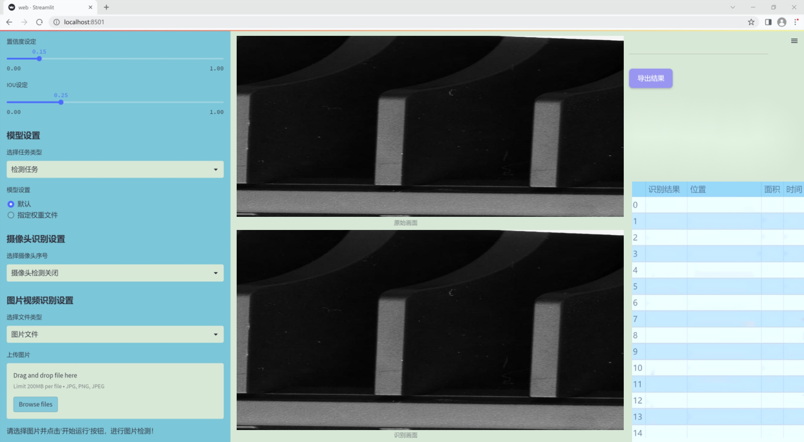
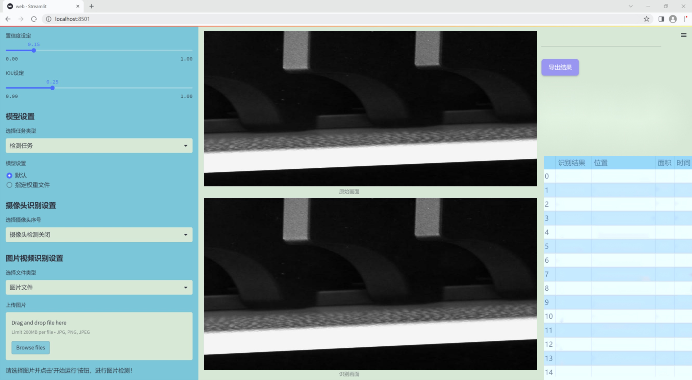
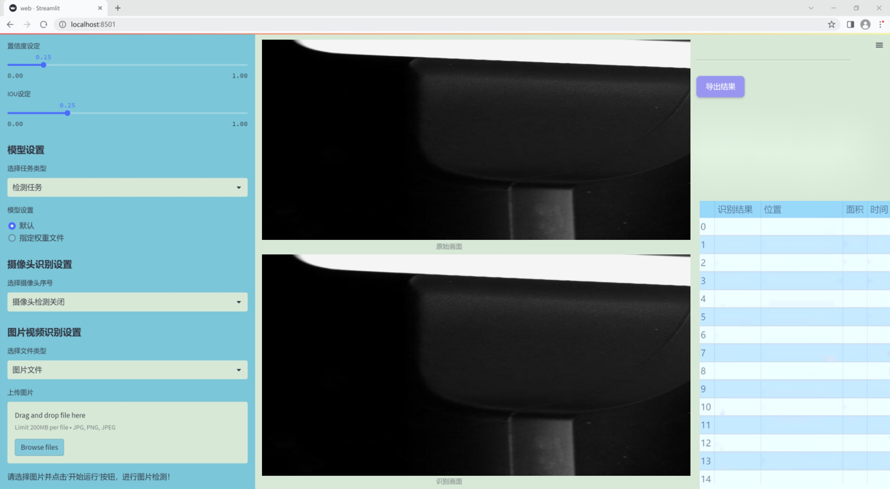
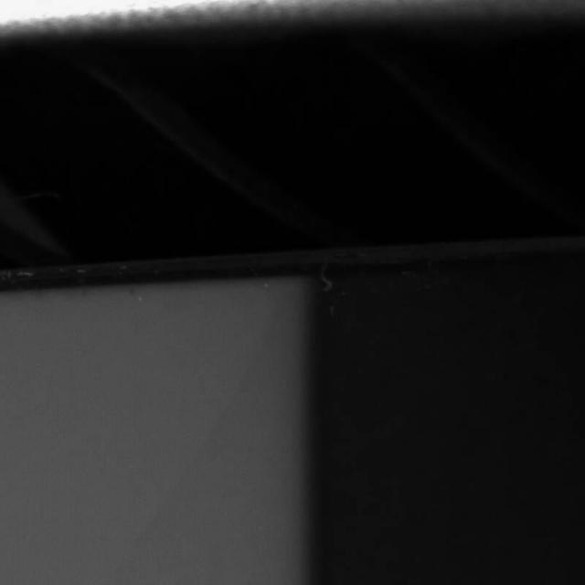
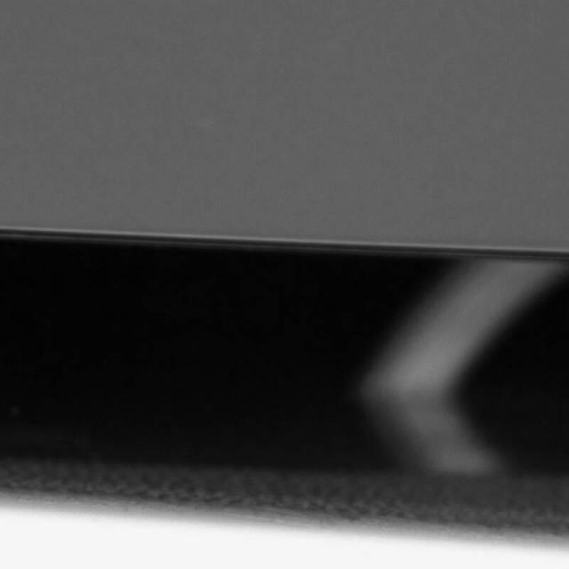

### 1.背景意义

研究背景与意义

随着电子产品的快速发展，控制台作为一种重要的消费电子设备，其生产和质量控制变得愈发重要。控制台在使用过程中可能会出现多种缺陷，如碰撞、污垢、缝隙和划痕等，这些缺陷不仅影响产品的外观，还可能影响其功能和用户体验。因此，建立一个高效、准确的缺陷检测系统显得尤为重要。传统的人工检测方法不仅耗时耗力，而且容易受到人为因素的影响，导致检测结果的不一致性和准确性不足。为了解决这一问题，基于计算机视觉的自动缺陷检测技术逐渐成为研究的热点。

在众多计算机视觉算法中，YOLO（You Only Look Once）系列模型因其高效的实时检测能力而受到广泛关注。YOLOv11作为该系列的最新版本，具备更强的特征提取能力和更快的处理速度，适合于复杂环境下的缺陷检测任务。本研究旨在基于改进的YOLOv11模型，构建一个针对控制台缺陷的检测系统，以实现对碰撞、污垢、缝隙和划痕等四类缺陷的精准识别。

本项目使用的数据集“Consolesliced2”包含3500张经过精确标注的图像，涵盖了四种缺陷类型。这一数据集为模型的训练和评估提供了丰富的样本，有助于提高模型的泛化能力和检测精度。通过对该数据集的深入分析和应用，研究将探索如何优化YOLOv11模型的结构和参数设置，以提高其在控制台缺陷检测中的表现。

综上所述，本研究不仅具有重要的理论意义，也为实际生产中的质量控制提供了新的思路和方法。通过实现高效的缺陷检测系统，能够有效降低人工成本，提高产品质量，进而提升消费者的满意度和企业的市场竞争力。

### 2.视频效果

[2.1 视频效果](https://www.bilibili.com/video/BV1JqqrYJEH5/)

### 3.图片效果







##### [项目涉及的源码数据来源链接](https://kdocs.cn/l/cszuIiCKVNis)**

注意：本项目提供训练的数据集和训练教程,由于版本持续更新,暂不提供权重文件（best.pt）,请按照6.训练教程进行训练后实现上图演示的效果。

### 4.数据集信息

##### 4.1 本项目数据集类别数＆类别名

nc: 4
names: ['Collision', 'Dirty', 'Gap', 'Scratch']


该项目为【图像分割】数据集，请在【训练教程和Web端加载模型教程（第三步）】这一步的时候按照【图像分割】部分的教程来训练

##### 4.2 本项目数据集信息介绍

本项目数据集信息介绍

本项目所使用的数据集名为“Consolesliced2”，旨在为改进YOLOv11的控制台缺陷检测系统提供强有力的支持。该数据集专注于控制台表面的各种缺陷，涵盖了四个主要类别，分别为“Collision”（碰撞）、“Dirty”（脏污）、“Gap”（缝隙）和“Scratch”（划痕）。这些类别的选择是基于对控制台在实际使用中可能出现的常见问题的深入分析，确保模型能够有效识别并分类不同类型的缺陷。

在数据集的构建过程中，收集了大量高质量的图像，确保每个类别都有足够的样本量，以便于训练和验证模型的性能。每张图像都经过精心标注，标注信息不仅包括缺陷的类别，还涵盖了缺陷的具体位置和范围，这为后续的模型训练提供了丰富的上下文信息。通过这种方式，数据集能够帮助YOLOv11在特征提取和缺陷识别方面实现更高的准确率。

此外，数据集中的图像来源多样，涵盖了不同光照条件、角度和背景的控制台，旨在提高模型的鲁棒性和泛化能力。通过这种多样化的训练数据，改进后的YOLOv11能够在实际应用中更好地适应各种环境和条件，提升缺陷检测的效率和准确性。

综上所述，“Consolesliced2”数据集不仅为改进YOLOv11提供了坚实的基础，也为后续的缺陷检测研究奠定了重要的理论和实践依据。通过对该数据集的深入挖掘和应用，期望能够推动控制台缺陷检测技术的发展，为相关行业的质量控制提供更为精准和高效的解决方案。








### 5.全套项目环境部署视频教程（零基础手把手教学）

[5.1 所需软件PyCharm和Anaconda安装教程（第一步）](https://www.bilibili.com/video/BV1BoC1YCEKi/?spm_id_from=333.999.0.0&vd_source=bc9aec86d164b67a7004b996143742dc)


[5.2 安装Python虚拟环境创建和依赖库安装视频教程（第二步）](https://www.bilibili.com/video/BV1ZoC1YCEBw?spm_id_from=333.788.videopod.sections&vd_source=bc9aec86d164b67a7004b996143742dc)

### 6.改进YOLOv11训练教程和Web_UI前端加载模型教程（零基础手把手教学）

[6.1 改进YOLOv11训练教程和Web_UI前端加载模型教程（第三步）](https://www.bilibili.com/video/BV1BoC1YCEhR?spm_id_from=333.788.videopod.sections&vd_source=bc9aec86d164b67a7004b996143742dc)


按照上面的训练视频教程链接加载项目提供的数据集，运行train.py即可开始训练



     Epoch   gpu_mem       box       obj       cls    labels  img_size
     1/200     20.8G   0.01576   0.01955  0.007536        22      1280: 100%|██████████| 849/849 [14:42<00:00,  1.04s/it]
               Class     Images     Labels          P          R     mAP@.5 mAP@.5:.95: 100%|██████████| 213/213 [01:14<00:00,  2.87it/s]
                 all       3395      17314      0.994      0.957      0.0957      0.0843

     Epoch   gpu_mem       box       obj       cls    labels  img_size
     2/200     20.8G   0.01578   0.01923  0.007006        22      1280: 100%|██████████| 849/849 [14:44<00:00,  1.04s/it]
               Class     Images     Labels          P          R     mAP@.5 mAP@.5:.95: 100%|██████████| 213/213 [01:12<00:00,  2.95it/s]
                 all       3395      17314      0.996      0.956      0.0957      0.0845

     Epoch   gpu_mem       box       obj       cls    labels  img_size
     3/200     20.8G   0.01561    0.0191  0.006895        27      1280: 100%|██████████| 849/849 [10:56<00:00,  1.29it/s]
               Class     Images     Labels          P          R     mAP@.5 mAP@.5:.95: 100%|███████   | 187/213 [00:52<00:00,  4.04it/s]
                 all       3395      17314      0.996      0.957      0.0957      0.0845


###### [项目数据集下载链接](https://kdocs.cn/l/cszuIiCKVNis)

### 7.原始YOLOv11算法讲解


ultralytics发布了最新的作品YOLOv11，这一次YOLOv11的变化相对于ultralytics公司的上一代作品YOLOv8变化不是很大的（YOLOv9、YOLOv10均不是ultralytics公司作品），其中改变的位置涉及到C2f变为C3K2，在SPPF后面加了一层类似于注意力机制的C2PSA，还有一个变化大家从yaml文件是看不出来的就是它的检测头内部替换了两个DWConv，以及模型的深度和宽度参数进行了大幅度调整，但是在损失函数方面就没有变化还是采用的CIoU作为边界框回归损失，下面带大家深入理解一下ultralytics最新作品YOLOv11的创新点。

**下图为最近的YOLO系列发布时间线！**


* * *

###### YOLOv11和YOLOv8对比

在YOLOYOLOv5，YOLOv8，和YOLOv11是ultralytics公司作品（ultralytics出品必属精品），下面用一张图片从yaml文件来带大家对比一下YOLOv8和YOLOv11的区别，配置文件变得内容比较少大家可以看一卡，左侧为YOLOv8右侧为YOLOv11，不同的点我用黑线标注了出来。


* * *

###### YOLOv11的网络结构解析

下面的图片为YOLOv11的网络结构图。


**其中主要创新点可以总结如下- > **

* * *

1\.
提出C3k2机制，其中C3k2有参数为c3k，其中在网络的浅层c3k设置为False（下图中可以看到c3k2第二个参数被设置为False，就是对应的c3k参数）。


此时所谓的C3k2就相当于YOLOv8中的C2f，其网络结构为一致的，其中的C3k机制的网络结构图如下图所示
**（为什么叫C3k2，我个人理解是因为C3k的调用时C3k其中的参数N固定设置为2的原因，个人理解不一定对** ）。


* * *

2\.
第二个创新点是提出C2PSA机制，这是一个C2（C2f的前身）机制内部嵌入了一个多头注意力机制，在这个过程中我还发现作者尝试了C2fPSA机制但是估计效果不如C2PSA，有的时候机制有没有效果理论上真的很难解释通，下图为C2PSA机制的原理图，仔细观察把Attention哪里去掉则C2PSA机制就变为了C2所以我上面说C2PSA就是C2里面嵌入了一个PSA机制。


* * *

3\.
第三个创新点可以说是原先的解耦头中的分类检测头增加了两个DWConv，具体的对比大家可以看下面两个图下面的是YOLOv11的解耦头，上面的是YOLOv8的解耦头.


我们上面看到了在分类检测头中YOLOv11插入了两个DWConv这样的做法可以大幅度减少参数量和计算量（原先两个普通的Conv大家要注意到卷积和是由3变为了1的，这是形成了两个深度可分离Conv），大家可能不太理解为什么加入了两个DWConv还能够减少计算量，以及什么是深度可分离Conv，下面我来解释一下。

> **`DWConv` 代表 Depthwise
> Convolution（深度卷积）**，是一种在卷积神经网络中常用的高效卷积操作。它主要用于减少计算复杂度和参数量，尤其在移动端或轻量化网络（如
> MobileNet）中十分常见。
>
> **1\. 标准卷积的计算过程**
>
> 在标准卷积操作中，对于一个输入张量（通常是一个多通道的特征图），卷积核的尺寸是 `(h, w, C_in)`，其中 `h` 和 `w`
> 是卷积核的空间尺寸，`C_in`
> 是输入通道的数量。而卷积核与输入张量做的是完整的卷积运算，每个输出通道都与所有输入通道相连并参与卷积操作，导致计算量比较大。
>
> 标准卷积的计算过程是这样的：
>
>   * 每个输出通道是所有输入通道的组合（加权求和），卷积核在每个位置都会计算与所有输入通道的点积。
>   * 假设有 `C_in` 个输入通道和 `C_out` 个输出通道，那么卷积核的总参数量是 `C_in * C_out * h * w`。
>

>
> 2\. **Depthwise Convolution（DWConv）**
>
> 与标准卷积不同， **深度卷积** 将输入的每个通道单独处理，即 **每个通道都有自己的卷积核进行卷积**
> ，不与其他通道进行交互。它可以被看作是标准卷积的一部分，专注于空间维度上的卷积运算。
>
> **深度卷积的计算过程：**
>
>   * 假设输入张量有 `C_in` 个通道，每个通道会使用一个 `h × w`
> 的卷积核进行卷积操作。这个过程称为“深度卷积”，因为每个通道独立进行卷积运算。
>   * 输出的通道数与输入通道数一致，每个输出通道只和对应的输入通道进行卷积，没有跨通道的组合。
>   * 参数量和计算量相比标准卷积大大减少，卷积核的参数量是 `C_in * h * w`。
>

>
> **深度卷积的优点：**
>
>   1. **计算效率高** ：相对于标准卷积，深度卷积显著减少了计算量。它只处理空间维度上的卷积，不再处理通道间的卷积。
>   2.  **参数量减少** ：由于每个卷积核只对单个通道进行卷积，参数量大幅减少。例如，标准卷积的参数量为 `C_in * C_out * h *
> w`，而深度卷积的参数量为 `C_in * h * w`。
>   3.  **结合点卷积可提升效果** ：为了弥补深度卷积缺乏跨通道信息整合的问题，通常深度卷积后会配合 `1x1` 的点卷积（Pointwise
> Convolution）使用，通过 `1x1` 的卷积核整合跨通道的信息。这种组合被称为 **深度可分离卷积** （Depthwise
> Separable Convolution） | **这也是我们本文YOLOv11中的做法** 。
>

>
> 3\. **深度卷积与标准卷积的区别**
>
> 操作类型| 卷积核大小| 输入通道数| 输出通道数| 参数量  
> ---|---|---|---|---  
> 标准卷积| `h × w`| `C_in`| `C_out`| `C_in * C_out * h * w`  
> 深度卷积（DWConv）| `h × w`| `C_in`| `C_in`| `C_in * h * w`  
>  
> 可以看出，深度卷积在相同的卷积核大小下，参数量减少了约 `C_out` 倍
> （细心的人可以发现用最新版本的ultralytics仓库运行YOLOv8参数量相比于之前的YOLOv8以及大幅度减少了这就是因为检测头改了的原因但是名字还是Detect，所以如果你想继续用YOLOv8发表论文做实验那么不要更新最近的ultralytics仓库）。
>
> **4\. 深度可分离卷积 (Depthwise Separable Convolution)**
>
> 深度卷积常与 `1x1` 的点卷积配合使用，这称为深度可分离卷积。其过程如下：
>
>   1. 先对输入张量进行深度卷积，对每个通道独立进行空间卷积。
>   2. 然后通过 `1x1` 点卷积，对通道维度进行混合，整合不同通道的信息。
>

>
> 这样既可以保证计算量的减少，又可以保持跨通道的信息流动。
>
> 5\. **总结**
>
> `DWConv` 是一种高效的卷积方式，通过单独处理每个通道来减少计算量，结合 `1x1`
> 的点卷积，形成深度可分离卷积，可以在保持网络性能的同时极大地减少模型的计算复杂度和参数量。

**看到这里大家应该明白了为什么加入了两个DWConv还能减少参数量以及YOLOv11的检测头创新点在哪里。**

* * *

##### YOLOv11和YOLOv8还有一个不同的点就是其各个版本的模型（N - S - M- L - X）网络深度和宽度变了


可以看到在深度（depth）和宽度
（width）两个地方YOLOv8和YOLOv11是基本上完全不同了，这里我理解这么做的含义就是模型网络变小了，所以需要加深一些模型的放缩倍数来弥补模型之前丧失的能力从而来达到一个平衡。

> **本章总结：**
> YOLOv11的改进点其实并不多更多的都是一些小的结构上的创新，相对于之前的YOLOv5到YOLOv8的创新，其实YOLOv11的创新点不算多，但是其是ultralytics公司的出品，同时ultralytics仓库的使用量是非常多的（不像YOLOv9和YOLOv10）所以在未来的很长一段时间内其实YOLO系列估计不会再更新了，YOLOv11作为最新的SOTA肯定是十分适合大家来发表论文和创新的。
>

### 8.200+种全套改进YOLOV11创新点原理讲解

#### 8.1 200+种全套改进YOLOV11创新点原理讲解大全

由于篇幅限制，每个创新点的具体原理讲解就不全部展开，具体见下列网址中的改进模块对应项目的技术原理博客网址【Blog】（创新点均为模块化搭建，原理适配YOLOv5~YOLOv11等各种版本）

[改进模块技术原理博客【Blog】网址链接](https://gitee.com/qunmasj/good)


#### 8.2 精选部分改进YOLOV11创新点原理讲解

###### 这里节选部分改进创新点展开原理讲解(完整的改进原理见上图和[改进模块技术原理博客链接](https://gitee.com/qunmasj/good)【如果此小节的图加载失败可以通过CSDN或者Github搜索该博客的标题访问原始博客，原始博客图片显示正常】
### CBAM空间注意力机制
近年来，随着深度学习研究方向的火热，注意力机制也被广泛地应用在图像识别、语音识别和自然语言处理等领域，注意力机制在深度学习任务中发挥着举足轻重的作用。注意力机制借鉴于人类的视觉系统，例如，人眼在看到一幅画面时，会倾向于关注画面中的重要信息，而忽略其他可见的信息。深度学习中的注意力机制和人类视觉的注意力机制相似，通过扫描全局数据，从大量数据中选择出需要重点关注的、对当前任务更为重要的信息，然后对这部分信息分配更多的注意力资源，从这些信息中获取更多所需要的细节信息，而抑制其他无用的信息。而在深度学习中，则具体表现为给感兴趣的区域更高的权重，经过网络的学习和调整，得到最优的权重分配，形成网络模型的注意力，使网络拥有更强的学习能力，加快网络的收敛速度。
注意力机制通常可分为软注意力机制和硬注意力机制[4-5]。软注意力机制在选择信息时，不是从输入的信息中只选择1个，而会用到所有输入信息，只是各个信息对应的权重分配不同，然后输入网络模型进行计算;硬注意力机制则是从输入的信息中随机选取一个或者选择概率最高的信息，但是这一步骤通常是不可微的，导致硬注意力机制更难训练。因此，软注意力机制应用更为广泛，按照原理可将软注意力机制划分为:通道注意力机制（channel attention)、空间注意力机制(spatial attention）和混合域注意力机制(mixed attention)。
通道注意力机制的本质建立各个特征通道之间的重要程度，对感兴趣的通道进行重点关注，弱化不感兴趣的通道的作用;空间注意力的本质则是建模了整个空间信息的重要程度，然后对空间内感兴趣的区域进行重点关注，弱化其余非感兴趣区域的作用;混合注意力同时运用了通道注意力和空间注意力，两部分先后进行或并行，形成对通道特征和空间特征同时关注的注意力模型。

卷积层注意力模块(Convolutional Block Attention Module，CBAM）是比较常用的混合注意力模块，其先后集中了通道注意力模块和空间注意力模块，网络中加入该模块能有效提高网络性能，减少网络模型的计算量，模块结构如图所示。输入特征图首先经过分支的通道注意力模块，然后和主干的原特征图融合，得到具有通道注意力的特征图，接着经过分支的空间注意力模块，在和主干的特征图融合后，得到同时具有通道特征注意力和空间特征注意力的特征图。CBAM模块不改变输入特征图的大小，因此该模块是一个“即插即用”的模块，可以插入网络的任何位置。

通道注意力模块的结构示意图如图所示，通道注意力模块分支并行地对输入的特征图进行最大池化操作和平均池化操作，然后利用多层感知机对结果进行变换，得到应用于两个通道的变换结果，最后经过sigmoid激活函数将变换结果融合，得到具有通道注意力的通道特征图。

空间注意力模块示意图如图所示，将通道注意力模块输出的特征图作为该模块的输入特征图，首先对输入特征图进行基于通道的最大池化操作和平均池化操作，将两部分得到的结果拼接起来，然后通过卷积得到降为Ⅰ通道的特征图，最后通过sigmoid激活函数生成具有空间注意力的特征图。


### 9.系统功能展示

图9.1.系统支持检测结果表格显示

  图9.2.系统支持置信度和IOU阈值手动调节

  图9.3.系统支持自定义加载权重文件best.pt(需要你通过步骤5中训练获得)

  图9.4.系统支持摄像头实时识别

  图9.5.系统支持图片识别

  图9.6.系统支持视频识别

  图9.7.系统支持识别结果文件自动保存

  图9.8.系统支持Excel导出检测结果数据


### 10. YOLOv11核心改进源码讲解

#### 10.1 test_selective_scan_speed.py

以下是经过精简和注释的核心代码部分，主要保留了选择性扫描的核心逻辑，并对其进行了详细的中文注释。

```python
import torch
import torch.nn.functional as F

def build_selective_scan_fn(selective_scan_cuda: object = None, mode="mamba_ssm"):
    """构建选择性扫描函数的工厂函数，返回一个自定义的前向和反向传播函数。"""
    
    class SelectiveScanFn(torch.autograd.Function):
        @staticmethod
        def forward(ctx, u, delta, A, B, C, D=None, z=None, delta_bias=None, delta_softplus=False, return_last_state=False):
            """前向传播函数，计算选择性扫描的输出。"""
            # 确保输入张量是连续的
            u = u.contiguous()
            delta = delta.contiguous()
            if D is not None:
                D = D.contiguous()
            B = B.contiguous()
            C = C.contiguous()
            if z is not None:
                z = z.contiguous()
            
            # 处理输入的维度和形状
            assert u.shape[1] % (B.shape[1]) == 0  # 确保形状兼容
            
            # 调用CUDA实现的选择性扫描前向函数
            out, x, *rest = selective_scan_cuda.fwd(u, delta, A, B, C, D, z, delta_bias, delta_softplus)

            # 保存必要的上下文以便反向传播
            ctx.save_for_backward(u, delta, A, B, C, D, z, delta_bias, x)
            last_state = x[:, :, -1, 1::2]  # 获取最后状态
            return out if not return_last_state else (out, last_state)

        @staticmethod
        def backward(ctx, dout):
            """反向传播函数，计算梯度。"""
            u, delta, A, B, C, D, z, delta_bias, x = ctx.saved_tensors
            
            # 调用CUDA实现的选择性扫描反向函数
            du, ddelta, dA, dB, dC, dD, ddelta_bias, *rest = selective_scan_cuda.bwd(
                u, delta, A, B, C, D, z, delta_bias, dout, x, None, False
            )
            
            return (du, ddelta, dA, dB, dC, dD, None, ddelta_bias, None)

    def selective_scan_fn(u, delta, A, B, C, D=None, z=None, delta_bias=None, delta_softplus=False, return_last_state=False):
        """选择性扫描的外部接口，调用自定义的前向和反向函数。"""
        return SelectiveScanFn.apply(u, delta, A, B, C, D, z, delta_bias, delta_softplus, return_last_state)

    return selective_scan_fn

def selective_scan_ref(u, delta, A, B, C, D=None, z=None, delta_bias=None, delta_softplus=False, return_last_state=False):
    """选择性扫描的参考实现，主要用于验证和测试。"""
    dtype_in = u.dtype
    u = u.float()
    delta = delta.float()
    
    # 处理偏置
    if delta_bias is not None:
        delta = delta + delta_bias[..., None].float()
    if delta_softplus:
        delta = F.softplus(delta)

    batch, dim, dstate = u.shape[0], A.shape[0], A.shape[1]
    x = A.new_zeros((batch, dim, dstate))  # 初始化状态

    ys = []
    deltaA = torch.exp(torch.einsum('bdl,dn->bdln', delta, A))  # 计算deltaA
    for i in range(u.shape[2]):
        x = deltaA[:, :, i] * x + deltaB_u[:, :, i]  # 更新状态
        y = torch.einsum('bdn,dn->bd', x, C)  # 计算输出
        ys.append(y)

    y = torch.stack(ys, dim=2)  # 堆叠输出
    out = y if D is None else y + u * rearrange(D, "d -> d 1")  # 加上D的影响
    if z is not None:
        out = out * F.silu(z)  # 应用z的影响
    out = out.to(dtype=dtype_in)
    
    return out if not return_last_state else (out, x)

# 这里可以添加测试函数或其他逻辑
```

### 代码注释说明：
1. **build_selective_scan_fn**: 该函数用于构建选择性扫描的前向和反向传播函数，返回一个可调用的函数。
2. **SelectiveScanFn**: 这是一个自定义的PyTorch函数，包含前向和反向传播的实现。
3. **forward**: 前向传播函数，计算选择性扫描的输出，并保存必要的上下文以供反向传播使用。
4. **backward**: 反向传播函数，计算输入的梯度。
5. **selective_scan_ref**: 参考实现，用于验证选择性扫描的正确性，包含对输入的处理和输出的计算。

通过这些注释，可以更好地理解每个部分的功能和逻辑。

这个文件 `test_selective_scan_speed.py` 是一个用于测试选择性扫描（Selective Scan）速度的程序，主要使用 PyTorch 框架进行深度学习相关的计算。程序中包含了多个函数和类，用于实现选择性扫描的前向和反向传播，并进行性能测试。

首先，程序导入了必要的库，包括 `torch` 和 `pytest`，以及一些用于处理张量的工具，如 `einops`。接着，定义了一个 `build_selective_scan_fn` 函数，这个函数的作用是构建一个选择性扫描的自定义操作。该操作是通过继承 `torch.autograd.Function` 来实现的，包含了 `forward` 和 `backward` 两个静态方法。

在 `forward` 方法中，首先对输入的张量进行连续性检查，确保它们的内存布局是连续的。接着，根据不同的模式（如 `mamba_ssm`、`sscore` 等）调用 CUDA 实现的前向函数，计算输出结果。这个方法还会保存一些必要的上下文信息，以便在反向传播时使用。

`backward` 方法则负责计算梯度，使用保存的上下文信息和输入张量来调用相应的 CUDA 后向函数。它处理了多种情况，包括可能存在的额外输入张量（如 `D` 和 `z`），并确保返回的梯度具有正确的形状和数据类型。

接下来，定义了 `selective_scan_ref` 函数，这是一个参考实现，用于计算选择性扫描的结果。这个实现不依赖于 CUDA，主要用于验证 CUDA 实现的正确性。它通过对输入张量进行逐步计算，最终返回输出结果和最后的状态。

此外，程序还定义了 `selective_scan_easy` 和 `selective_scan_easy_v2` 函数，这些函数是选择性扫描的简化版本，适用于不同的输入格式和参数设置。

最后，程序的核心是 `test_speed` 函数，它负责设置测试参数并执行多次选择性扫描的前向和反向传播，以测量不同实现的性能。测试过程中，使用了 `torch.cuda.synchronize()` 来确保 GPU 计算完成，并通过时间记录来评估每个测试的执行时间。

整体来看，这个文件的主要目的是实现选择性扫描的功能，并通过性能测试来比较不同实现的效率。程序中使用了许多深度学习中的常见技术，如自动求导、CUDA 加速和张量操作等，展示了在高性能计算中的应用。

#### 10.2 lsknet.py

以下是保留的核心代码部分，并附上详细的中文注释：

```python
import torch
import torch.nn as nn
from functools import partial

class Mlp(nn.Module):
    """ 多层感知机模块 """
    def __init__(self, in_features, hidden_features=None, out_features=None, act_layer=nn.GELU, drop=0.):
        super().__init__()
        out_features = out_features or in_features  # 输出特征数
        hidden_features = hidden_features or in_features  # 隐藏层特征数
        self.fc1 = nn.Conv2d(in_features, hidden_features, 1)  # 第一个卷积层
        self.dwconv = DWConv(hidden_features)  # 深度卷积层
        self.act = act_layer()  # 激活函数
        self.fc2 = nn.Conv2d(hidden_features, out_features, 1)  # 第二个卷积层
        self.drop = nn.Dropout(drop)  # Dropout层

    def forward(self, x):
        """ 前向传播 """
        x = self.fc1(x)  # 通过第一个卷积层
        x = self.dwconv(x)  # 通过深度卷积层
        x = self.act(x)  # 激活
        x = self.drop(x)  # Dropout
        x = self.fc2(x)  # 通过第二个卷积层
        x = self.drop(x)  # Dropout
        return x

class Block(nn.Module):
    """ 网络的基本块，包括注意力机制和多层感知机 """
    def __init__(self, dim, mlp_ratio=4., drop=0., drop_path=0., act_layer=nn.GELU):
        super().__init__()
        self.norm1 = nn.BatchNorm2d(dim)  # 第一个归一化层
        self.norm2 = nn.BatchNorm2d(dim)  # 第二个归一化层
        self.attn = Attention(dim)  # 注意力模块
        self.mlp = Mlp(in_features=dim, hidden_features=int(dim * mlp_ratio), act_layer=act_layer, drop=drop)  # MLP模块

    def forward(self, x):
        """ 前向传播 """
        x = x + self.attn(self.norm1(x))  # 加入注意力模块的输出
        x = x + self.mlp(self.norm2(x))  # 加入MLP模块的输出
        return x

class LSKNet(nn.Module):
    """ LSKNet网络结构 """
    def __init__(self, img_size=224, in_chans=3, embed_dims=[64, 128, 256, 512], depths=[3, 4, 6, 3]):
        super().__init__()
        self.num_stages = len(depths)  # 网络的阶段数

        for i in range(self.num_stages):
            # 每个阶段的嵌入层
            patch_embed = OverlapPatchEmbed(img_size=img_size // (2 ** i), in_chans=in_chans if i == 0 else embed_dims[i - 1], embed_dim=embed_dims[i])
            # 每个阶段的块
            block = nn.ModuleList([Block(dim=embed_dims[i]) for _ in range(depths[i])])
            setattr(self, f"patch_embed{i + 1}", patch_embed)  # 动态设置属性
            setattr(self, f"block{i + 1}", block)  # 动态设置属性

    def forward(self, x):
        """ 前向传播 """
        outs = []
        for i in range(self.num_stages):
            patch_embed = getattr(self, f"patch_embed{i + 1}")  # 获取嵌入层
            block = getattr(self, f"block{i + 1}")  # 获取块
            x, H, W = patch_embed(x)  # 嵌入
            for blk in block:
                x = blk(x)  # 通过每个块
            outs.append(x)  # 保存输出
        return outs

class DWConv(nn.Module):
    """ 深度卷积模块 """
    def __init__(self, dim=768):
        super(DWConv, self).__init__()
        self.dwconv = nn.Conv2d(dim, dim, 3, 1, 1, groups=dim)  # 深度卷积

    def forward(self, x):
        """ 前向传播 """
        return self.dwconv(x)  # 通过深度卷积

def lsknet_t(weights=''):
    """ 构建LSKNet T版本 """
    model = LSKNet(embed_dims=[32, 64, 160, 256], depths=[3, 3, 5, 2])
    if weights:
        model.load_state_dict(torch.load(weights)['state_dict'])  # 加载权重
    return model

if __name__ == '__main__':
    model = lsknet_t('lsk_t_backbone-2ef8a593.pth')  # 实例化模型
    inputs = torch.randn((1, 3, 640, 640))  # 随机输入
    for i in model(inputs):
        print(i.size())  # 输出每个阶段的输出尺寸
```

### 代码说明：
1. **Mlp类**：实现了一个多层感知机，包括两个卷积层和一个深度卷积层。
2. **Block类**：实现了网络的基本块，包含注意力机制和多层感知机。
3. **LSKNet类**：构建了整个网络结构，包含多个阶段，每个阶段由嵌入层和多个块组成。
4. **DWConv类**：实现了深度卷积，用于特征提取。
5. **lsknet_t函数**：用于创建LSKNet的T版本，并可选择加载预训练权重。

这些核心部分构成了网络的基本结构，能够进行图像特征提取和处理。

这个程序文件定义了一个名为 `lsknet.py` 的深度学习模型，主要用于图像处理任务。该模型的结构是基于卷积神经网络（CNN）和注意力机制，旨在提取图像特征。以下是对代码的详细讲解。

首先，程序导入了必要的库，包括 PyTorch 和一些用于构建神经网络的模块。接着，定义了一个名为 `Mlp` 的类，它实现了一个多层感知机（MLP），包括两个卷积层和一个深度卷积层（DWConv），以及激活函数和 dropout 层。`Mlp` 类的 `forward` 方法描述了数据如何通过这些层进行前向传播。

接下来，定义了 `LSKblock` 类，这是模型的核心模块之一。它使用了深度卷积和空间卷积来提取特征，并通过注意力机制对特征进行加权。`forward` 方法中，输入经过多次卷积和注意力计算，最终输出与输入相乘的结果，以增强特征。

`Attention` 类实现了一个注意力机制模块，包含两个卷积层和一个 `LSKblock`。它通过对输入进行线性变换、激活和注意力计算来增强特征。

`Block` 类则是模型的基本构建块，包含归一化层、注意力层和 MLP。它通过残差连接将输入与经过处理的特征相加，以保持信息的流动。

`OverlapPatchEmbed` 类负责将输入图像转换为补丁嵌入。它使用卷积层将图像分割成多个补丁，并进行归一化处理。

`LSKNet` 类是整个网络的主体，包含多个阶段，每个阶段由补丁嵌入、多个 `Block` 和归一化层组成。它的 `forward` 方法依次处理输入数据，输出每个阶段的特征图。

`DWConv` 类实现了深度卷积操作，用于特征提取。

此外，程序还定义了一个 `update_weight` 函数，用于更新模型的权重。`lsknet_t` 和 `lsknet_s` 函数分别创建两种不同配置的 LSKNet 模型，并可以加载预训练权重。

最后，在 `__main__` 块中，程序实例化了一个 LSKNet 模型，并对一个随机生成的输入进行前向传播，打印输出特征图的尺寸。

总体来说，这个程序实现了一个复杂的图像处理模型，结合了多种深度学习技术，适用于图像分类、目标检测等任务。

#### 10.3 kacn_conv.py

以下是代码中最核心的部分，并附上详细的中文注释：

```python
import torch
import torch.nn as nn

class KACNConvNDLayer(nn.Module):
    def __init__(self, conv_class, norm_class, input_dim, output_dim, degree, kernel_size,
                 groups=1, padding=0, stride=1, dilation=1,
                 ndim: int = 2, dropout=0.0):
        super(KACNConvNDLayer, self).__init__()
        
        # 初始化参数
        self.inputdim = input_dim  # 输入维度
        self.outdim = output_dim    # 输出维度
        self.degree = degree         # 多项式的度数
        self.kernel_size = kernel_size  # 卷积核大小
        self.padding = padding       # 填充
        self.stride = stride         # 步幅
        self.dilation = dilation     # 膨胀
        self.groups = groups         # 分组卷积的组数
        self.ndim = ndim             # 数据的维度（1D, 2D, 3D）
        self.dropout = None          # Dropout层初始化为None

        # 如果dropout大于0，则根据维度选择相应的Dropout层
        if dropout > 0:
            if ndim == 1:
                self.dropout = nn.Dropout1d(p=dropout)
            elif ndim == 2:
                self.dropout = nn.Dropout2d(p=dropout)
            elif ndim == 3:
                self.dropout = nn.Dropout3d(p=dropout)

        # 检查groups参数的有效性
        if groups <= 0:
            raise ValueError('groups must be a positive integer')
        if input_dim % groups != 0:
            raise ValueError('input_dim must be divisible by groups')
        if output_dim % groups != 0:
            raise ValueError('output_dim must be divisible by groups')

        # 创建分组归一化层
        self.layer_norm = nn.ModuleList([norm_class(output_dim // groups) for _ in range(groups)])

        # 创建多项式卷积层
        self.poly_conv = nn.ModuleList([conv_class((degree + 1) * input_dim // groups,
                                                   output_dim // groups,
                                                   kernel_size,
                                                   stride,
                                                   padding,
                                                   dilation,
                                                   groups=1,
                                                   bias=False) for _ in range(groups)])
        
        # 注册一个缓冲区，用于存储多项式的系数
        arange_buffer_size = (1, 1, -1,) + tuple(1 for _ in range(ndim))
        self.register_buffer("arange", torch.arange(0, degree + 1, 1).view(*arange_buffer_size))
        
        # 使用Kaiming均匀分布初始化卷积层的权重
        for conv_layer in self.poly_conv:
            nn.init.normal_(conv_layer.weight, mean=0.0, std=1 / (input_dim * (degree + 1) * kernel_size ** ndim))

    def forward_kacn(self, x, group_index):
        # 前向传播，应用激活函数和线性变换
        x = torch.tanh(x)  # 应用tanh激活函数
        x = x.acos().unsqueeze(2)  # 计算反余弦并增加一个维度
        x = (x * self.arange).flatten(1, 2)  # 乘以多项式系数并展平
        x = x.cos()  # 计算余弦值
        x = self.poly_conv[group_index](x)  # 通过对应的卷积层
        x = self.layer_norm[group_index](x)  # 通过对应的归一化层
        if self.dropout is not None:
            x = self.dropout(x)  # 如果有dropout，则应用dropout
        return x

    def forward(self, x):
        # 前向传播，处理输入数据
        split_x = torch.split(x, self.inputdim // self.groups, dim=1)  # 按组分割输入
        output = []
        for group_ind, _x in enumerate(split_x):
            y = self.forward_kacn(_x.clone(), group_ind)  # 对每个组进行前向传播
            output.append(y.clone())  # 将结果添加到输出列表
        y = torch.cat(output, dim=1)  # 将所有组的输出拼接在一起
        return y
```

### 代码说明：
1. **KACNConvNDLayer**: 这是一个自定义的卷积层类，支持任意维度的卷积操作。它的构造函数接受卷积类型、归一化类型、输入输出维度、卷积核大小等参数，并进行初始化。
2. **forward_kacn**: 这是该类的核心前向传播方法，应用了多项式卷积和归一化，并可以选择性地应用dropout。
3. **forward**: 该方法处理输入数据，将其分割成多个组，并对每个组调用`forward_kacn`进行处理，最后将结果拼接在一起返回。

这个程序文件定义了一个名为 `kacn_conv.py` 的模块，主要实现了一个自定义的卷积层，称为 KACNConvNDLayer 及其一维、二维和三维的特化版本。该模块使用 PyTorch 框架，包含了卷积操作、归一化、激活函数等功能，适用于多维数据的处理。

首先，`KACNConvNDLayer` 类是一个通用的卷积层，接受多个参数以配置卷积操作，包括输入和输出维度、卷积核大小、分组数、填充、步幅、扩张率、丢弃率等。构造函数中，首先进行了一些参数的验证，确保分组数为正整数，并且输入和输出维度能够被分组数整除。接着，初始化了归一化层和多项式卷积层。多项式卷积层的数量与分组数相同，每个卷积层的输入通道数是输入维度与分组数的比值乘以多项式的度数加一。

在前向传播过程中，`forward` 方法将输入张量按组进行拆分，并对每个组调用 `forward_kacn` 方法进行处理。`forward_kacn` 方法中，首先对输入进行激活，然后进行线性变换，接着应用多项式卷积和归一化，最后根据需要应用丢弃层。

接下来的三个类 `KACNConv3DLayer`、`KACNConv2DLayer` 和 `KACNConv1DLayer` 是对 `KACNConvNDLayer` 的特化，分别实现了三维、二维和一维的卷积操作。它们在构造函数中调用了父类的构造函数，并传入相应的卷积和归一化类。

整体来看，这个模块提供了一种灵活的方式来实现多维卷积操作，结合了多项式卷积和归一化的特点，适用于需要复杂特征提取的深度学习任务。

#### 10.4 efficientViT.py

以下是简化后的代码，保留了核心部分，并添加了详细的中文注释：

```python
import torch
import torch.nn as nn
import torch.nn.functional as F
import itertools

# 定义卷积层和批归一化的组合
class Conv2d_BN(torch.nn.Sequential):
    def __init__(self, in_channels, out_channels, kernel_size=1, stride=1, padding=0, dilation=1, groups=1, bn_weight_init=1):
        super().__init__()
        # 添加卷积层
        self.add_module('conv', torch.nn.Conv2d(in_channels, out_channels, kernel_size, stride, padding, dilation, groups, bias=False))
        # 添加批归一化层
        self.add_module('bn', torch.nn.BatchNorm2d(out_channels))
        # 初始化批归一化的权重
        torch.nn.init.constant_(self.bn.weight, bn_weight_init)
        torch.nn.init.constant_(self.bn.bias, 0)

    @torch.no_grad()
    def switch_to_deploy(self):
        # 将训练模式下的卷积和批归一化合并为一个卷积层
        conv, bn = self._modules.values()
        w = bn.weight / (bn.running_var + bn.eps)**0.5
        w = conv.weight * w[:, None, None, None]
        b = bn.bias - bn.running_mean * bn.weight / (bn.running_var + bn.eps)**0.5
        m = torch.nn.Conv2d(w.size(1) * conv.groups, w.size(0), w.shape[2:], stride=conv.stride, padding=conv.padding, dilation=conv.dilation, groups=conv.groups)
        m.weight.data.copy_(w)
        m.bias.data.copy_(b)
        return m

# 定义一个简单的前馈神经网络
class FFN(torch.nn.Module):
    def __init__(self, in_dim, hidden_dim):
        super().__init__()
        self.pw1 = Conv2d_BN(in_dim, hidden_dim)  # 第一层卷积
        self.act = torch.nn.ReLU()  # 激活函数
        self.pw2 = Conv2d_BN(hidden_dim, in_dim, bn_weight_init=0)  # 第二层卷积

    def forward(self, x):
        # 前向传播
        x = self.pw2(self.act(self.pw1(x)))
        return x

# 定义EfficientViT的基本模块
class EfficientViTBlock(torch.nn.Module):
    def __init__(self, in_dim, key_dim, num_heads=8):
        super().__init__()
        self.dw0 = Conv2d_BN(in_dim, in_dim, kernel_size=3, stride=1, padding=1, groups=in_dim)  # 深度卷积
        self.ffn0 = FFN(in_dim, in_dim * 2)  # 前馈网络
        self.mixer = FFN(in_dim, in_dim)  # 注意力机制
        self.dw1 = Conv2d_BN(in_dim, in_dim, kernel_size=3, stride=1, padding=1, groups=in_dim)  # 深度卷积
        self.ffn1 = FFN(in_dim, in_dim * 2)  # 前馈网络

    def forward(self, x):
        # 前向传播
        x = self.ffn1(self.dw1(self.mixer(self.ffn0(self.dw0(x)))))
        return x

# 定义EfficientViT模型
class EfficientViT(torch.nn.Module):
    def __init__(self, img_size=224, embed_dim=[64, 128, 192], depth=[1, 2, 3]):
        super().__init__()
        self.patch_embed = Conv2d_BN(3, embed_dim[0] // 8, kernel_size=3, stride=2, padding=1)  # 图像嵌入
        self.blocks = nn.ModuleList()  # 存储多个EfficientViTBlock
        for i in range(len(depth)):
            for _ in range(depth[i]):
                self.blocks.append(EfficientViTBlock(embed_dim[i], key_dim=16, num_heads=4))  # 添加块

    def forward(self, x):
        x = self.patch_embed(x)  # 图像嵌入
        for block in self.blocks:
            x = block(x)  # 通过每个块
        return x

# 测试模型
if __name__ == '__main__':
    model = EfficientViT()  # 创建模型实例
    inputs = torch.randn((1, 3, 224, 224))  # 创建随机输入
    res = model(inputs)  # 前向传播
    print(res.size())  # 输出结果的尺寸
```

### 代码说明：
1. **Conv2d_BN**: 这是一个自定义的卷积层，包含卷积操作和批归一化，支持在推理时将两者合并以提高效率。
2. **FFN**: 定义了一个简单的前馈神经网络，包含两个卷积层和一个ReLU激活函数。
3. **EfficientViTBlock**: 这是EfficientViT的基本构建块，包含深度卷积和前馈网络。
4. **EfficientViT**: 整个模型的定义，包含图像嵌入和多个EfficientViTBlock的堆叠。
5. **主函数**: 创建模型实例并进行一次前向传播，输出结果的尺寸。

这个程序文件实现了一个高效的视觉变换器（EfficientViT）模型架构，主要用于图像分类等下游任务。文件中包含了多个类和函数，构成了整个模型的结构。

首先，程序导入了必要的库，包括PyTorch及其相关模块，以及一些辅助函数和类。然后定义了一个名为`Conv2d_BN`的类，它继承自`torch.nn.Sequential`，用于创建一个包含卷积层和批归一化层的模块。这个类还提供了一个`switch_to_deploy`方法，用于在推理阶段将批归一化层融合到卷积层中，以提高推理效率。

接下来，`replace_batchnorm`函数用于遍历网络中的所有子模块，将批归一化层替换为恒等映射，从而在推理时提高效率。

`PatchMerging`类用于将输入特征图进行合并，生成更高层次的特征表示。它包含多个卷积层和激活函数，并使用了Squeeze-and-Excitation模块来增强特征。

`Residual`类实现了残差连接的功能，允许在训练过程中引入随机丢弃，以增强模型的鲁棒性。

`FFN`类定义了一个前馈神经网络，包含两个线性层和一个ReLU激活函数。

`CascadedGroupAttention`类实现了级联组注意力机制，通过多个卷积层对输入进行处理，计算注意力权重，并将其应用于输入特征图。

`LocalWindowAttention`类实现了局部窗口注意力机制，允许模型在局部范围内进行注意力计算，从而提高计算效率。

`EfficientViTBlock`类是EfficientViT的基本构建块，结合了卷积、前馈网络和注意力机制，形成一个完整的模块。

`EfficientViT`类是整个模型的核心，负责构建网络的各个阶段。它包含了多个`EfficientViTBlock`，并通过`patch_embed`模块将输入图像分割成补丁进行处理。模型的各个阶段可以根据配置参数进行调整，包括嵌入维度、深度、注意力头数等。

最后，文件定义了一些不同配置的EfficientViT模型（如`EfficientViT_m0`到`EfficientViT_m5`），并提供了加载预训练权重和替换批归一化层的功能。`update_weight`函数用于更新模型权重，并打印加载的权重数量。

在`__main__`部分，代码实例化了一个`EfficientViT_M0`模型，并对随机生成的输入进行前向传播，输出每个阶段的特征图大小。

总体而言，这个程序实现了一个灵活且高效的视觉变换器模型，适用于各种计算机视觉任务。

### 11.完整训练+Web前端界面+200+种全套创新点源码、数据集获取


# [下载链接：https://mbd.pub/o/bread/Z5yZkpZu](https://mbd.pub/o/bread/Z5yZkpZu)